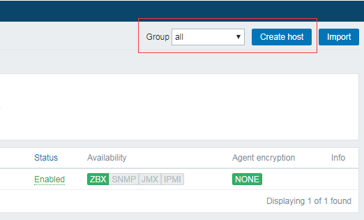
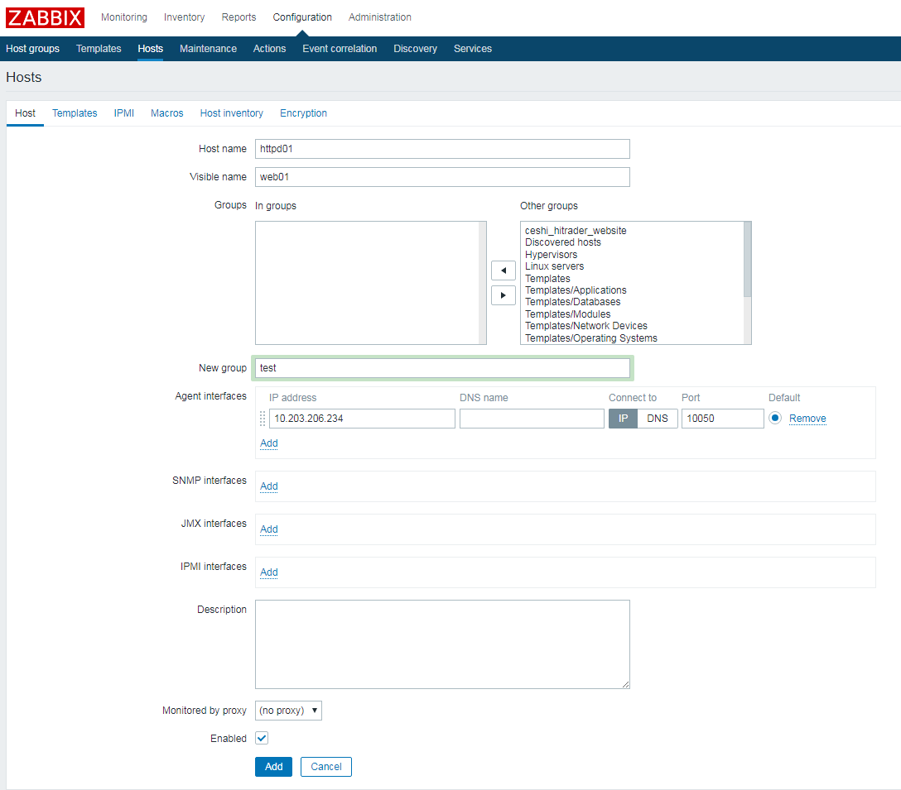
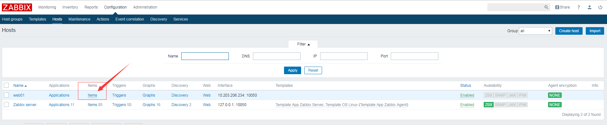
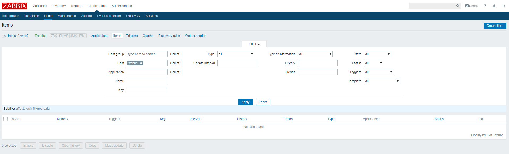

首先打开浏览器输入地址 http://192.168.1.1:8889

用户名: admin

密码: zabbix

登陆成功之后会看到zabbix的控制台界面

登陆之后会看到很多标题栏和可视化的内容, 如果有主机触发监控报警就会直接显示在dashboard这个页面上

接下来配置一个基本的监控来实现邮件报警功能

点击Configuration选项下的Hosts标签会打开主机配置界面会看到一个基本的主机是指向zabbix本机

创建一个要监控主机的ip地址和端口号以及主机名称, 这个主机名称和服务器上面的hostname要保持一致

为目标主机创建一个监控项目,已便于后期监控

