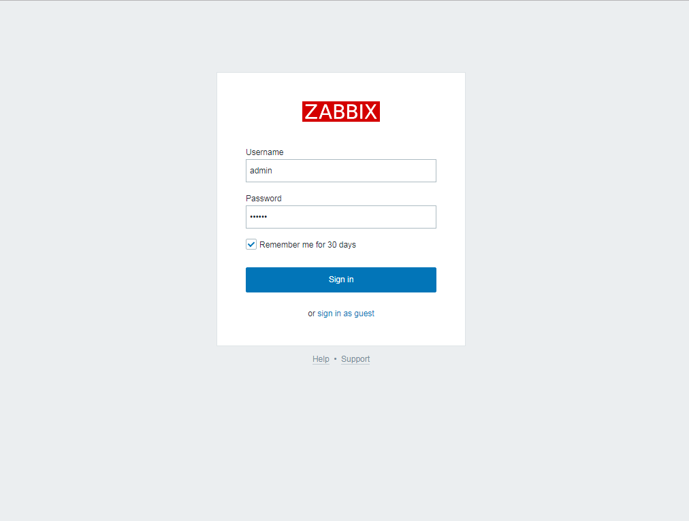
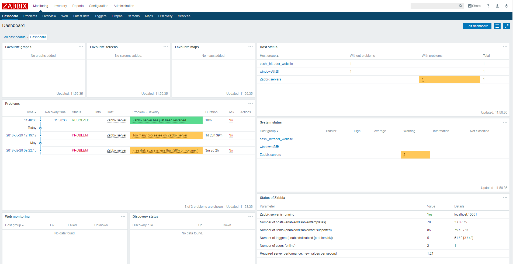
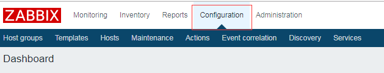
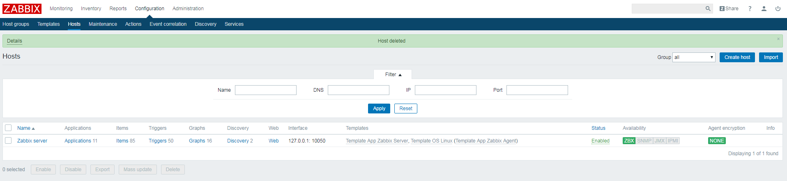

首先打开浏览器输入地址 http://192.168.1.1:8889

用户名: admin

密码: zabbix

登陆成功之后会看到zabbix的控制台界面

登陆之后会看到很多标题栏和可视化的内容, 如果有主机触发监控报警就会直接显示在dashboard这个页面上

接下来配置一个基本的监控来实现邮件报警功能

点击 Configuration选项下的Hosts标签会打开主机配置界面

